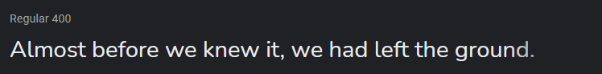

# My Portfolio - v2.5

This is the source code for my personal portfolio website.

    
    
    
    

  

## Table of Contents

- [Design](#design)
  - [Fonts](#fonts)
  - [Color Scheme](#color-scheme)
  - [Icon](#icon)
- [Built With](#built-with)
- [Creator](#creator)

---

## Design

### Fonts

[Fire Code](https://fonts.google.com/specimen/Fira+Code) - headings and code text

[Nunito](https://fonts.google.com/specimen/Nunito) - normal text

### Color Scheme

- White - all normal text color
- Oxford Blue - page background color, text color on white background
- Charm Pink - links, nav bar item hover, icon hover color
- Shamrock Green - Charm Pink links hover color
- Viridian Green - project skill text color
- Slate Gray - mobile navbar background color

### Icon

This is the icon of me on the Home and About pages.

_Art credits to my friend [wynn.draws](https://www.instagram.com/wynn.draws/)._

---
## Built With

- 💙 [HTML5](https://www.w3schools.com/html/)
- 💜 [CSS3](https://www.w3schools.com/css/)
- 💙 [JavaScript](https://www.w3schools.com/js/DEFAULT.asp)
- 💜 [Flaticon](https://www.flaticon.com/) and [FontAwesome](https://fontawesome.com/v5.15/icons?d=gallery&p=1) for the icons
- 💙 [Google Domains](https://domains.google/) for the cool domain
- 💜 [Netlify](https://www.netlify.com/) for hosting
- 💙 [Figma](https://www.figma.com/) for design and prototyping tools

---

## Creator

Shreyansh Goushal 

If you have any questions, comments, or concerns, feel free to contact me below.

  

This project was created for educational purposes and for personal use. 
- If you are interested in forking this to use as a template for your own portfolio website, please give credit (i.e., in the README) and ensure to update all information and content to be yours before deploying, so you are not displaying my content and information as your own. Thanks.

---

## License

Copyright &copy; 2021-2024 Shreyansh Goushal. All rights reserved.
